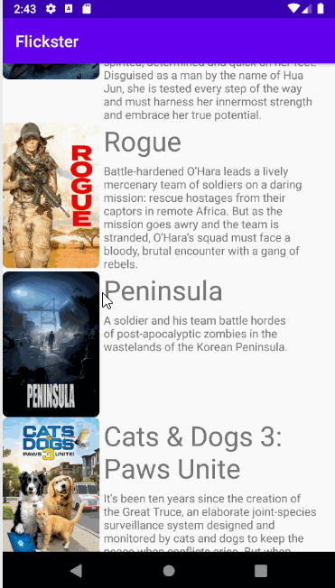
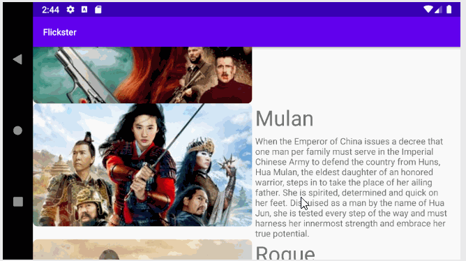

# Flix
Flix is an app that allows users to browse movies from the [The Movie Database API](http://docs.themoviedb.apiary.io/#).

📝 `NOTE - PASTE PART 2 SNIPPET HERE:` Paste the README template for part 2 of this assignment here at the top. This will show a history of your development process, which users stories you completed and how your app looked and functioned at each step.

---

## Flix Part 2

### User Stories

#### REQUIRED (10pts)
- [x] (8pts) Expose details of movie (ratings using RatingBar, popularity, and synopsis) in a separate activity.
- [x] (2pts) Allow video posts to be played in full-screen using the YouTubePlayerView.

#### BONUS
- [ ] Trailers for popular movies are played automatically when the movie is selected (1 point).
  - [ ] When clicking on a popular movie (i.e. a movie voted for more than 5 stars) the video should be played immediately.
  - [ ] Less popular videos rely on the detailed page should show an image preview that can initiate playing a YouTube video.
- [ ] Add a play icon overlay to popular movies to indicate that the movie can be played (1 point).
- [ ] Apply the popular ButterKnife annotation library to reduce view boilerplate. (1 point)
- [x] Add a rounded corners for the images using the Glide transformations. (1 point)
- [x] Implement a shared element transition when user clicks into the details of a movie (1 point)

### App Walkthough GIFs

### Portrait browinsg
 

### Landscape browsing
 

### Notes
1. Was difficult to navigate around depreceated methods and outdated notes regarding Roundcorners and shared element transitions
2. I had trouble recalling Git terminal methods for pushing a new repo, pulling readme file, and pushing the gif to the repo.
3. Understanding the Movieadapter and it's call mappings was difficult.
4. Unable to setup navigation/scrolling on the landscape view. Would love to hear how to get this done so I can display popularity_score and release_date

### Open-source libraries used

- [Android Async HTTP](https://github.com/codepath/CPAsyncHttpClient) - Simple asynchronous HTTP requests with JSON parsing
- [Glide](https://github.com/bumptech/glide) - Image loading and caching library for Androids
- [YoutubeAndroidPlayerAPI] (https://developers.google.com/youtube/android/player/) - Fetching youtube videos for movie trailers and playing it in Android application
